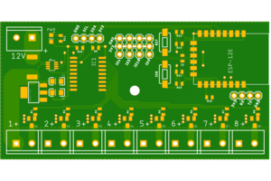

# ESP8266 based 12V switch

This is a project that uses an ESP8266 to drive 8x MOSFET power ports,
rated at 2A each. It incorporates a GPIO buffer (based on MCP23008) to
allow the MCU to reboot without changing the port status, and a current
sensor (based on INA219) to measure total current through the device.

## Hardware

The schematic and board layout are in the [eagle/](eagle/) directory.
Logical components in the hardware are:

*   An LDO that steps down 12V input to 3.3V, with power LED
*   An INA219 on I2C that senses current using a 0.01 Ohm shunt resistor (32A max in 80mA steps)
*   An MCP23008 8-port GPIO expander on I2C
*   8 output ports, driven by IRLML6244 mosfets (3A max per channel)
*   An ESP8266-12E which drives the current sensor and GPIO expander over I2C
    *    RST and GPIO0 are provided via pushbuttons
*   Headers:
    *    I2C breakout for additional sensor(s)
    *    4x GPIO breakouts (GPIO: 4, 5, 9, 10)
    *    Serial access to flash the ESP8266

### BOM

Bill of materials with components and sizes:

*   AM1117-3.3V
*   C1, C2: 10uF Tantalum (3216)
*   C3: 470pF ceramic (0805)
*   IC1: MCP23008 (SO18W)
*   IO0/RST: momentary switch (6mm x 3.5mm)
*   J1-J9: screw terminal (0.2" pitch)
*   J10,J11: 4-pin standard header (0.1" pitch)
*   J12-15: 3-pin standard header (0.1" pitch)
*   MDL1: ESP8266-ESP12E
*   PWR: Green LED (0805)
*   Q1-Q8: IRLML6244 (SOT23)
*   R1-R8: 1kOhm (0805)
*   R9-R10, R12-16: 10kOhm (0805)
*   R11: 330Ohm (0805)
*   R17: 0.01Ohm Shunt (2515)
*   U1: INA219 (SOT23-8)

## Software

### API
